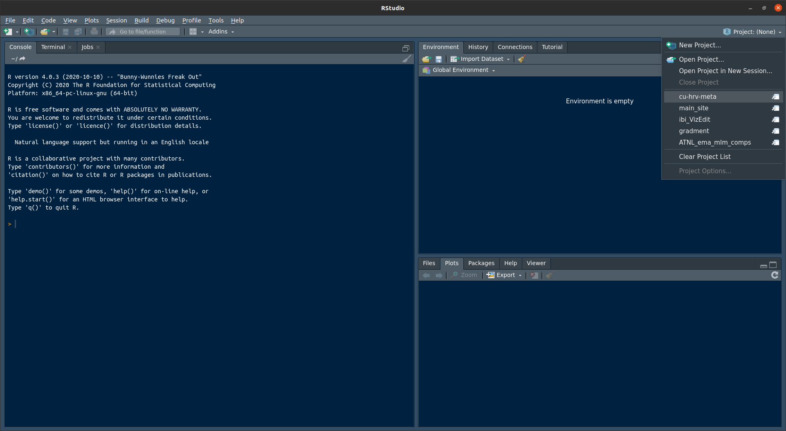

# Project Overview

The goal of this project is to estimate the average association between cardiac measures of autonomic nervous system functioning and callous-unemotional traits during childhood and adolescence. This repository contains the primary data and code base for the project. 

# How to Use the Repository

The repository serves as a record of the project and can be used to review the history of changes over time. The official branch is `main`, with commits and pull requests into `main` providing an open and transparent means of tracking project versioning over time. 

In addition to providing transparent tracking of changes, the repository can be cloned and interested parties may use it to reproduce our reported results or leverage the primary data for a secondary analysis. 

## Cloning the Repo 

[BASE lab](https://www.bu.edu/cdl/baselab/) members (PI: Nicholas Wagner, Ph.D.)  and collaborators have write access to the respository. They may clone its contents to a local folder and open up pull requests (PRs) with updates as needed. The `main` branch is a protected branch, which means that changes cannot be directly committed to it. All pull requests to the `main` branch require admin approval. Tag @dr-consulting for review. For more details see below. 

### Windows

There are two commonly used options for working with git repositories on a Windows operating system. [GitHub Desktop](https://desktop.github.com/) offers a complete graphical user interface for managing git repositories on a Windows machine. For those of who feel comfortable or want to build experience using git on the command line, there is also Git BASH - an emulation layer that allows the use of shell commands on  *NIX systems (e.g., Linux, macOS). 

### macOS/Linux

To install git on macOS, follow the instructions [here](https://git-scm.com/book/en/v2/Getting-Started-Installing-Git). Note there is an option to use GitHub desktop as well if interested. Most distributions of Linux ship with git installed. If git is not pre-installed, use the distribution's package manager to install. 

With both macOS and Linux systems, it is easy to use git directly in the terminal. Simply `cd` into the root directory of the repository and run your [git commands](https://www.atlassian.com/git/tutorials/atlassian-git-cheatsheet) there.

## Running the Code 

The easiest way of interacting with the code base is to open the project file in the cloned repo inside RStudio. Simple go to File --> Open Project in New Session... and select the file `cu-hrv-meta.Rproj`. If you have recently opened the project, you should be able to open it from the drop down menu located in the top right of the RStudio toolbar. 



## Opening Pull Requests

The repository follows a feature-branch pattern for [incorporating changes](https://www.atlassian.com/git/tutorials/comparing-workflows/feature-branch-workflow). To open a pull request using this pattern, follow the steps below. The steps below assume you are using the command line via a standard terminal (macOS or Linux) or in a git BASH terminal (Windows). The same procedures can be used inside the [GitHub desktop GUI](https://www.softwaretestinghelp.com/github-desktop-tutorial/). Additionally, Rstudio is [offers Git](https://support.rstudio.com/hc/en-us/articles/200532077-Version-Control-with-Git-and-SVN) integration which will cover better than 95% of what will be needed to work with this repo.

Of course to make changes to the repo you'll need to clone a local copy. Be sure you are in the folder you want to be. The example below uses the terminal command `cd` to change directories before cloning the repo. Change `~` to the parent directory you want to clone into. 

```
cd ~  # assumes you want the repo to be saved in your system's "home" directory 
git clone https://github.com/dr-consulting/cu-hrv-meta.git
```

1. Check out the main branch. 

```
git checkout main
```

2. Pull in the most recent changes

```
git pull
```

3. Create a new "feature" branch.

```
git checkout -b my-feature-branch-name
```

4. Make changes to the files and save them as you normally would.

5. When you are ready add and commit your files, the push the changes up to the remote repository on GitHub. 

```
git add * 
```

The above should add any file types that are not explicitly ignored in the `.gitignore` file. If you find that a file isn't showing up though it may because that filetype is excluded from version tracking in the `.gitignore` file, usually to ensure that very large filetypes don't get accidentally added to the repository. 
Run `git status` if you are concerned that you may have added a file that you did not mean to. In general, files that exceed 50 MB should not be checked into the remote repository. 

6. Commit your changes and push them up to the remote. 

```
git commit -m "my short commit message" 
```

Commit messages should be short explanations of what has changed in the files you are pushing up.

7. Lastly push to the remote repository. If it is the first time pushing to your feature branch you should run: 

```
git push -u origin my-feature-branch-name
```

If the branch already exists, you can omit the `-u origin my-feature-branch-name` part. That is only needed the first time pushing a brand new branch up to the remote repository.

8.  Once pushed up to the remote repository, you'll need to log in to GitHub and use the website UI to open a pull request targeting the `main` branch. Give the PR a title and add a brief comment that provides context on the nature of the proposed changes. Tag @dr-consulting for review. 

## Working with GoogleSheets

The `.Rmd` workflow template is just that a template. One useful feature of the template is that if you execute the code contained within, you will have effectively cleaned and transformed your data, and loaded all custom functions needed to work on variants of the base models. 

Additionally, in order to knit the document into an html or pdf report, you'll need to authenticate your credentials to ensure you are permitted access to the most up-to-date version of the raw data. Instructions for doing so are provided in the template itself. 