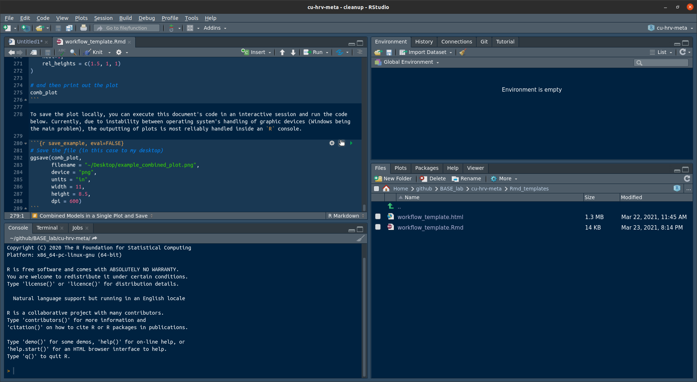

```{r setup, include=FALSE}
knitr::opts_chunk$set(echo = TRUE, warning = FALSE, message = FALSE)
#' Simple function for creating a negation 'in' function in R
#' 
`%notin%` <- Negate(`%in%`)
```

# Setup 
## Installing Stan
Part of the modeling step relies on Stan, an open-source Bayesian software package. [Be sure to follow the installation](https://github.com/stan-dev/rstan/wiki/RStan-Getting-Started) recommendations for your operating system (Windows, Mac, and Linux options are available). 

Be sure [_not to skip the configuration of your C++ Toolchain_ ](https://github.com/stan-dev/rstan/wiki/RStan-Getting-Started#configuring-c-toolchain) if required. Note that there are a couple of common errors that can happen with certain systems. Solutions to common problems are provided in the same set of instructions. 

## Required R Packages
If you are are already an enthusiastic R user, yay! You'll probably have many of the packages needed. If you are a begrudging R user, no worries - I get it. Hopefully, we can make the installation process as painless as possible. 

To install any missing packages that are used as part of this workflow run the following code: 
```{r install_r_pkgs}
pkgs <- c("devtools", "brms", "tidyverse", "tidybayes", "googlesheets4", "googledrive", "testthat", "cowplot", "stringr")

# loop over the packages and install if not present
for(pkg in pkgs) {
    if(pkg %notin% installed.packages()[,"Package"]) install.packages(pkg, repos = "http://cran.us.r-project.org")
}
```

## Allow Authentication 

Once you have installed the packages above, run the code in the block below in an interactive `R` Console. This step is best completed inside RStudio. Note that this code is not evaluated as part of the execution of this `.Rmd` document. You'll need to copy and paste it in the console. 

The easiest way to authenticate is to click the "Run All Chunks Above" button in the final code block on this document (scroll all the way to the bottom). Doing so will also yield every function and output loaded or produced in your active R session, making it easier to test things about before adding them to do the document. 

```{r, eval=FALSE}
googledrive::drive_auth(email = "your@email.com")
```

Now, we can load those packages in along with some custom functions built specifically for this project. The `here` package and its `here()` function are just ways to make this notebook executable regardless of where you save and open this project up. 

**IMPORTANT**: As with the code above, be sure to add _your_ email address (the one that has shared access to the raw data) in the `options` line below. After you add your email, it is a good idea to run all of the code chunks in the document. 



```{r load_tools, echo=FALSE}
library(tidyverse)
library(brms)
library(brmstools)
# Be sure to put your email in the slot below
options(gargle_oauth_email = "mbarstead@deadreckoning.consulting")
R_DIR <- paste0(here::here(), "/R")
sapply(list.files(R_DIR, full.names = TRUE), source)
```

# Data Load
One of the custom functions for this project wraps around the `googlesheets4` library. The main upside is that it let's users pull the most up to date data available when they want to run a new analysis. When you run the cell below, the `tidyverse` API will ask will attempt to authenticate using a cached token. If a token cannot be found, a broswer window will open to walk you through authentication steps. 

```{r data_load, message=TRUE}
url <- "https://docs.google.com/spreadsheets/d/17-ORYryysIIL5eUjXUvrNHx2tKX5ByhasOrhw6JDpaY/edit#gid=0"
raw_df <- load_and_save_gsheet(url)
```

If everything works as expected, the function should read the data in Sheet 1. Here is a good place to introduce the concept of defensive programming. The idea behind defensive programming is that you assert certain things are true after you have executed some command or set of commands. For instance, in the example below, I want to test the dimensionality of the returned data. Partly because I want to be aware, before this entire notebook runs, if new studies have been added or if certain, potentially relevant variables were dropped. 

```{r defense}
testthat::expect_is(raw_df, "data.frame")
testthat::expect_equal(dim(raw_df), c(114, 43))
```

Try playing with one of the numbers in the second command to see what happens when you try to run knit the file. 

# Data Wrangling

Now, it is time to start cleaning and transforming the data into the final sets of effects. At this point every effect of interest should be either a set of mean differences or a correlation. Our goal is to move every effect over to a correlation scale using several custom functions that should load when you execute your way through this template. 

## Correlation Effects and Their Variances
In the code below, I introduce the `%>%` operator (called a "pipe"). It allows us to pass the outputs of one function in as the inputs of the next function without having to save any intermediate steps. I also am going to use `mutate()` a powerful and often used function from the `dplyr` package to modify (ahem, "mutate") the original data frame `raw_df` by adding two columns. One is a straight copy with a more intuitive name, the other is the calculation of the standard error for the associated effects in that column. 

We can spot check that the copying works more or less as expected. 

```{r correlations}
full_df <- raw_df %>% 
    mutate(
        correlation_vals = r_cuXoutcome, 
        correlation_se = r_var(correlation_vals, N) %>% 
            sqrt()
    )

full_df %>% 
    select(citation, N, r_cuXoutcome, correlation_vals, correlation_se) %>% 
    head()
```

Okay... let's see if every correlation has a standard error. We are going to need both for the meta-analysis models. Here we'll use the `filter()` function to select rows based on whether our target columns of interest are `NA` or have valid values. (The `!` is negation here so read as "is not")

```{r missing_SE}
full_df %>% 
    select(citation, N, r_cuXoutcome, correlation_vals, correlation_se) %>% 
    filter(!is.na(correlation_vals) & is.na(correlation_se))
```

If there are any rows printed out, it suggests we likely need to track down the relevant `N` entry that is missing. No rows means that all of our correlations have a standard error term (yay!). 

## Standardized Mean Differences

Next up is the creation of standardized difference scores. We'll rely on Cohen's $d$ for this step. Once we get the effect and variance on a $d$ scale, we'll convert them to $r$'s and then combine all values into set of effects and a set of their standard errors. The nice thing about these functions is that they should return `NA` whenever a required value is missing in the data. 

```{r cohens_d}
full_df <- full_df %>% 
    mutate(
        cohens_d = calculate_d(m1=Cugrp_outcome_mean, sd1=Cugrp_outcome_SD, n1=N_CUgrp, 
                               m2=ctrl_outcome_mean, sd2=ctrl_outcome_SD, n2=N_CTRLgrp), 
        # Creating my combined effect here - will add in r's later to same column
        eff = d_to_r(cohens_d, n1=N_CUgrp, n2=N_CTRLgrp), 
        eff_se = d_to_r(cohens_d, n1=N_CUgrp, n2=N_CTRLgrp, return_var = TRUE) %>% 
            sqrt()
    )

full_df %>% 
    select(citation, Cugrp_outcome_mean, ctrl_outcome_mean, cohens_d, eff, eff_se) %>% 
    head()
```


## Combining Effects 

We are going to combine everything in the single `eff` and `eff_se` columns that we have calculated so far - **giving priority to correlations over standardized mean differences** that have been converted to correlations. We do this in a way that also preserves any missing values - which need to be fully investigated before any final models are generated. 

```{r combining}
full_df[["eff"]] <- ifelse(!is.na(full_df[["correlation_vals"]]), full_df[["correlation_vals"]], full_df[["eff"]])
full_df[["eff_se"]] <- ifelse(!is.na(full_df[["correlation_se"]]), full_df[["correlation_se"]], full_df[["eff_se"]])
full_df %>% 
    select(citation, correlation_vals, cohens_d, eff, eff_se) %>% 
    head(10)
```

At this point, we should look into any rows that do not have an effect and attempt to figure out why. 
```{r id_missing}
full_df %>% 
    filter(is.na(eff)) %>% 
    select(citation, correlation_vals, cohens_d, eff, eff_se)
```

This section in particular should be a useful starting point for tracking down issues with data entry and missing values. 
## Final Cleaning Step for Plots

Programmatically generating plots when there are special characters in the study id field (a comma in particular) is challenging in this workflow. The issue is how the effects get "looked up" when creating posterior distribution plots. 

The solution here is fairly straightforward, and we are going to use the `str_replace_all()` function to make it happen. 

```{r plot_cleaning}
# While were are at it may as well clean up the citations more fully here. 
full_df[['citation']][full_df[['citation']] == "Anastassiou-Hadjicharalambous, X., & Warden, D. (2008)."] <- 'Anastassiou-H. & Warden 2008'

# Now the layers of cleaning - first remove commas
full_df[['citation']] <- str_replace_all(full_df[['citation']], ",", "")

# Next remove parentheses - note the square brackets since these are "special" characters
full_df[['citation']] <- str_replace_all(full_df[['citation']], "[(]", "")
full_df[['citation']] <- str_replace_all(full_df[['citation']], "[)]", "")

# Lastly we'll remove the period
full_df[['citation']] <- str_replace_all(full_df[['citation']], "[.]", "")
```

## Building a Baseline Model

Assuming all of the outstanding data issues have been addressed, we can move on to the modeling phase. Arguably, the most fun phase, oftentimes the least important (the data cleaning and prep and detective work is always the most important!). 

We'll be using the `brms` package - an handy API wrapper around Stan that let's us, with minimal syntatic complexity, specify Bayesian multilevel models. There are nice simple walkthroughs of the meta-analysis use case for the package [here](https://vuorre.netlify.app/post/2017/01/19/better-forest-plots-from-meta-analytic-models-estimated-with-brms/) and [here](https://bookdown.org/MathiasHarrer/Doing_Meta_Analysis_in_R/bayesian-meta-analysis-in-r-using-the-brms-package.html). 

The formula follows a basic structure: `effect size | effect standard error ~ intercept + ... (intercept | study label)` with the `...` indicating space for additional predictors. For now, we just have an intercept and the inclusion of our study id as a clustering unit. This framework naturally lends itself to the inclusion of all effects from a single study by creating a "study-level" effect or random effect for the model intercept - which may be particularly helpful whenever there are multiple correlations gathered over time.

I am setting weakly informative priors on the intercept and variance terms - since we know that the values of correlations cannot exceed $\pm$ 1. For the intercept, which represents the pooled average across all studies in this initial model, we'll use a normal prior, with a standard deviation of .75. One way of thinking about this prior is that we expect at least 68% of the observed effects to return correlations between $r = -.75$ and $r = .75$. 

```{r basic_bayes}
# This name is currently horribly formatted when read in from the googlesheet - may want to change altogether
full_df[["baseline_status"]] <- full_df[["Baseline = 0; Task = 1; Reactivity = 2"]]
base_model <- "eff | se(eff_se) ~ 1 + (1|citation)" %>% brmsformula()

base_priors <- c(
    prior(normal(0, .75), class = Intercept), 
    prior(cauchy(0, .5), class = sd)
)

# Here we are filtering based just on baseline effects and only for PNS physio measures 
model_PNS_baseline <- brm(
    base_model, 
    prior = base_priors, 
    data = full_df %>% 
        filter(baseline_status == 0 & Outcome_system == "PNS"), 
    iter = 4000,
    warmup = 2500, 
    cores = 3, 
    chains = 3, 
    control = list(adapt_delta = .99, max_treedepth=15), 
    sample_prior = TRUE,  # We'll use this for computing Bayes Factors later on 
    refresh = 0  # prevents progress print out in the markdown file
)
```

### Inspecting Results
First, we want to check our posterior distributions. The goal is to assess some basic model fit. The resulting plot is decent. The main posterior predicted density is right about where we observe most of our effects. 

```{r ppcheck}
pp_check(model_PNS_baseline)
```

How about parameter convergence? 

```{r traceplot}
plot(model_PNS_baseline, pars = c("b_Intercept", "sd_citation__Intercept"))
```

A more or less normally distributed intercept and a positively skewed variance term - both in line with basic distributional expectations and the convergence of the traceplots appears adequate (i.e, all of the chains appear to be randomly exploring the same range along the y-axis). 

### Interpreting Results
First, let's start with the visual summary. Use the custom plotting function `plot_bayes_forest()` to generate a forest plot of posterior distributions.

```{r forest1}
PNS_baseline_forest <- plot_bayes_forest(
    model = model_PNS_baseline, 
    study_id = 'citation', 
    title = 'Model Estimates of Study-Specific and Pooled Correlations\nbetween PNS at Baseline and CU Traits',
    xlab = "Correlation Coefficient", 
    ylab = 'Citation', 
    x_limits = c(-.6, .6),
)

PNS_baseline_forest
```

### Tweaking the Plot

There are a few things to call out here with this custom function. The first is that the color and degree of opacity that represents the 95% credibility interval of the Pooled Effect can be adjusted. Simply pass in any valid color [hex code](https://htmlcolorcodes.com/) to change the color, or a color name understood by `ggplot` (e.g., `"blue"`). The transparency of the estimated population credibility interval can also be adjusted by passing in a decimal ranging from 0 (complete transparency) to 1 (complete opacity).

To make either of the adjustments above, simply add `fill_color = <your color>` or `fill_opacity = <your opacity level>`. 
Another noteworthy trick is the use of `\n` instead of a space in the title. The presence of `\n` instructs `ggplot` to start a new line and can be a useful way of breaking up longer titles. 

### Interpreting the Plot

First, it is important to stress that **the study effects displayed in the plot are not the observed correlations**. Instead, the study-level effects plotted are model-based estimates of the "true" effect size for each study (correlation in this case). In a multilevel modeling context, these are sometimes referred to as random effects. 

Second, we can see the model-generated posterior distribution for the population-level effect in the bottom row of the plot. In this case, the results indicate that the evidence against the overall correlation between PNS measurement at baseline and CU traits differing from 0 is fairly weak, given that the 95% credibility interval includes 0.

### Bayes Factors

We also assess the relative evidence for a directional hypothesis using the `brms` `hypothesis()` function. Note that `sample_prior = TRUE` has to be passed in when initially running the model and saving off the output. 

```{r evidence_ratio}
hypothesis(model_PNS_baseline, 'Intercept < 0')
```

The `Evid.Ratio` in the output above is a Bayes factor (for a cursory overview see [this Statistics How To page](https://www.statisticshowto.com/bayes-factor-definition/). In this case, the Bayes factor represents the ratio of evidence from the model that the true population effect is less than zero, compared with the evidence that the true population effect is greater than or equal to zero. A value of approximately 3.5 would generally be considered weak evidence in favor of the hypothesis. 

### Summary

So putting everything together here. The model found little support for the existence of an association between PNS measurements at baseline and CU traits. The average estimate of the population effect was $r = - .04$ with a 95% credibility interval that included 0. The Bayes factor associated with this directional effect indicated only weak support for the existence of a negative association relative to a positive association or 0 association. 

## Getting Additional Details

We can get the full model output printed here as well:
```{r model_summary}
summary(model_PNS_baseline) %>% 
    print(digits = 4)
```

Here we see that the `Intercept` is our main effect of interest. It represents the estimated population average, integrating across all available effects. The `sigma` is fixed to 0 because this is a "variance-known" multilevel model. We have already provided this information for every study in the analysis via the standard error of each effect (i.e., the `eff_se` column).

We can run the same model for `ANS` and `SNS` subsets of the data (_Note the removal of `"Fanti & Kimonis 2017"` - at the time of creation there was a data entry error affecting this entry_): 

```{r}
# First the ANS effects
model_ANS_baseline <- brm(
    base_model, 
    prior = base_priors, 
    data = full_df %>% 
        filter(baseline_status == 0 & Outcome_system == "ANS" & citation != "Fanti & Kimonis 2017"), 
    iter = 4000,
    warmup = 2500, 
    cores = 3, 
    chains = 3, 
    control = list(adapt_delta = .99, max_treedepth=15), 
    refresh = 0 # prevents progress print out in the markdown file
)

ANS_baseline_forest <- plot_bayes_forest(
    model = model_ANS_baseline, 
    study_id = 'citation', 
    title = 'Model Estimates of Study-Specific and Pooled Correlations\nbetween ANS at Baseline and CU Traits',
    xlab = "Correlation Coefficient", 
    ylab = 'Citation', 
    x_limits = c(-.6, .6),
)

# Then the SNS effects
model_SNS_baseline <- brm(
    base_model, 
    prior = base_priors, 
    data = full_df %>% 
        filter(baseline_status == 0 & Outcome_system == "SNS"), 
    iter = 4000,
    warmup = 2500, 
    cores = 3, 
    chains = 3, 
    control = list(adapt_delta = .99, max_treedepth=15), 
    refresh = 0 # prevents progress print out in the markdown file
)

SNS_baseline_forest <- plot_bayes_forest(
    model = model_SNS_baseline, 
    study_id = 'citation', 
    title = 'Model Estimates of Study-Specific and Pooled Correlations\nbetween SNS at Baseline and CU Traits',
    xlab = "Correlation Coefficient", 
    ylab = 'Citation', 
    x_limits = c(-.6, .6),
)
```

### Combined Models in a Single Plot and Save

I really like the `cowplot` package for simple combinations of plots. Here is one example. Notice that I had already set the x-axes to be equal in range when generating each plot. I also tweak the relative height of each plot to account for the fact that the models differ in the number of effects. Lastly, the `axis` (`'tblr'` stands for top, bottom, left, right) and `align` parameters ensure that the plot area for each graph lines up vertically (or horizontally if the number of columns rows in the plot layout changes).

```{r final_plot, fig.height=10}
comb_plot <- cowplot::plot_grid(
    ANS_baseline_forest, 
    PNS_baseline_forest, 
    SNS_baseline_forest, 
    ncol=1, 
    rel_heights = c(3.2, 2.4, 1), 
    axis = 'tblr', 
    align = 'hv'
)

# and then print out the plot
comb_plot
```

To save the plot locally, you can execute the code below. Currently, due to instability between operating system's handling of graphic devices (Windows being the main problem), the outputting of plots is most reliably handled inside an `R` console. 

```{r save_example, eval=FALSE}
# Save the file (in this case to my desktop)
ggsave(comb_plot, 
       filename = "~/Desktop/example_combined_plot.png", 
       device = "png", 
       units = "in", 
       width = 9, 
       height = 18, 
       dpi = 600)
```